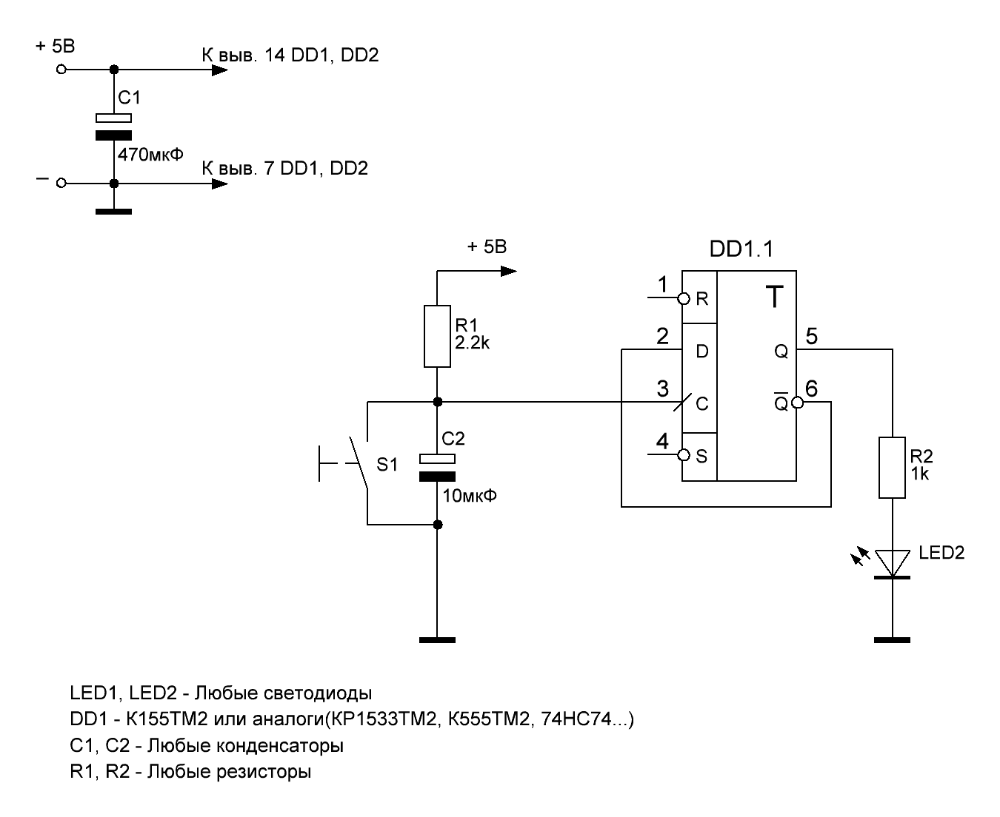
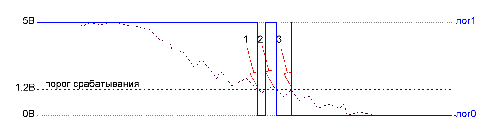
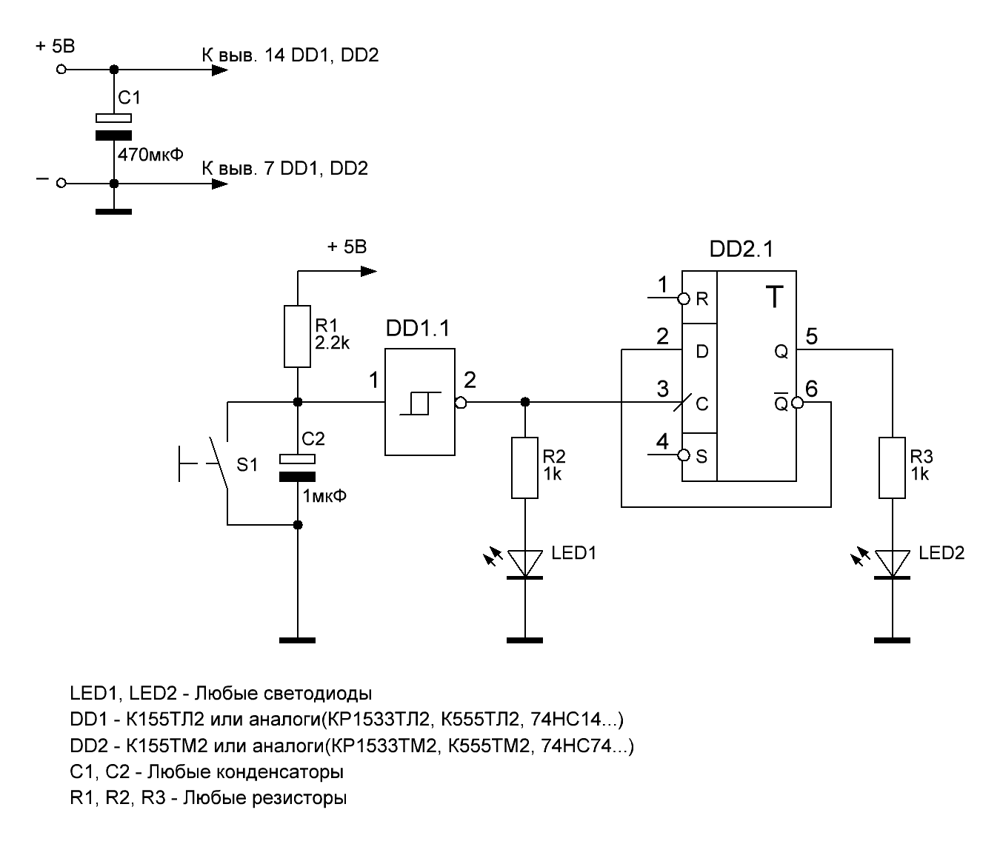
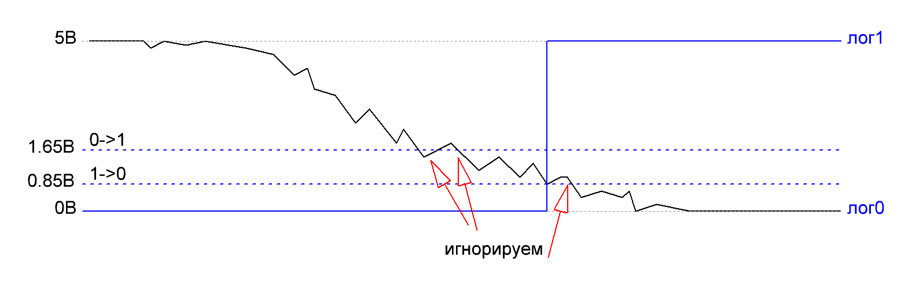
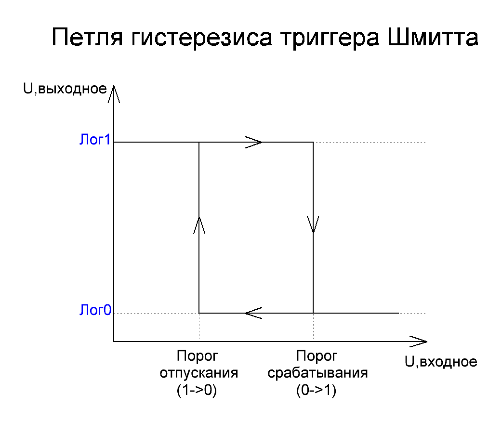
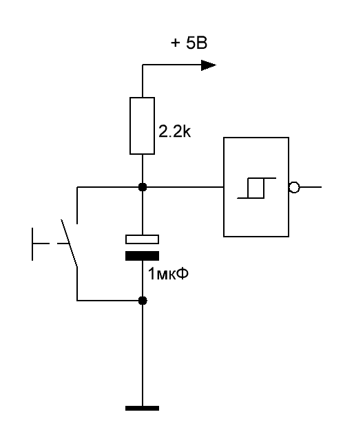

# Schmitt_trigger
https://youtu.be/WpkBAS-Ou-k

## bad:
### Плохая схема

### Работа плохой схемы

## good:
### Хорошая схема

### Работа хорошей схемы

### Петля гестерезиса

### Подавление дребезга контактов

License: https://creativecommons.org/licenses/by-nc/4.0/
